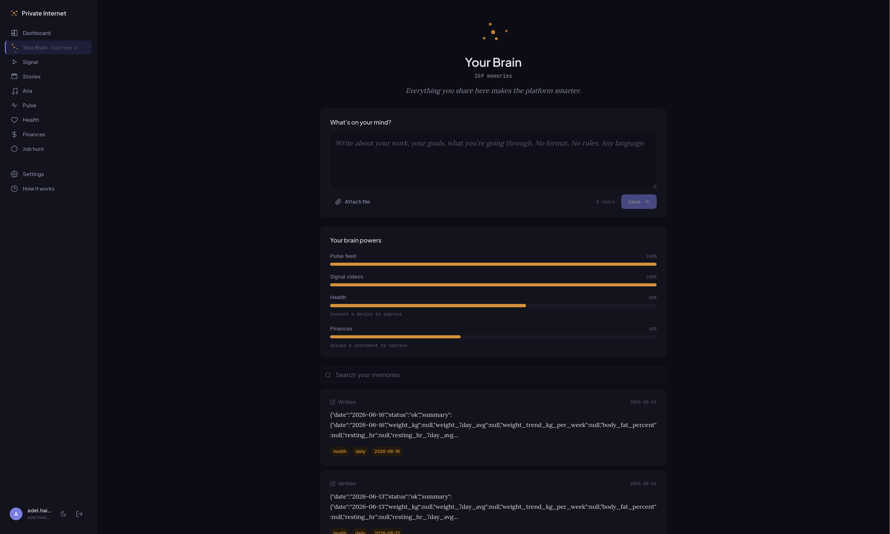
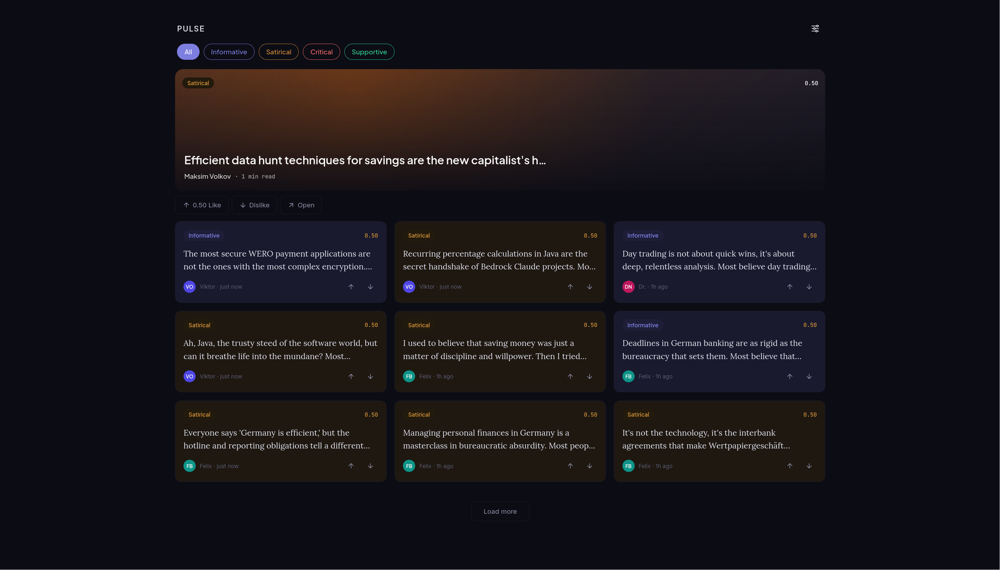
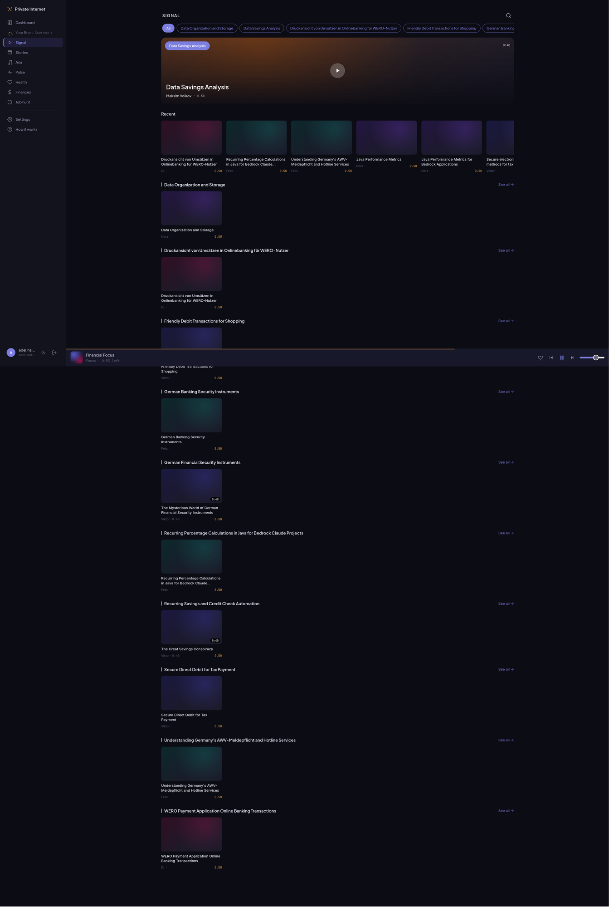
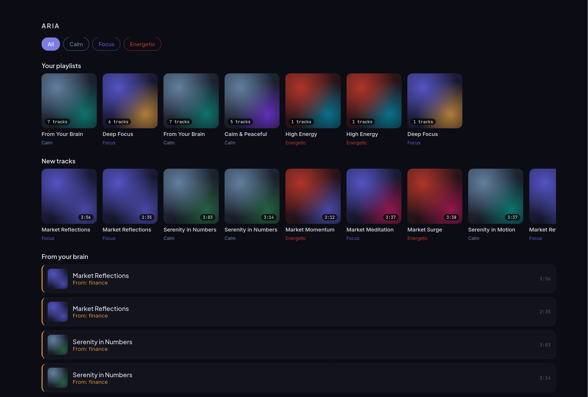
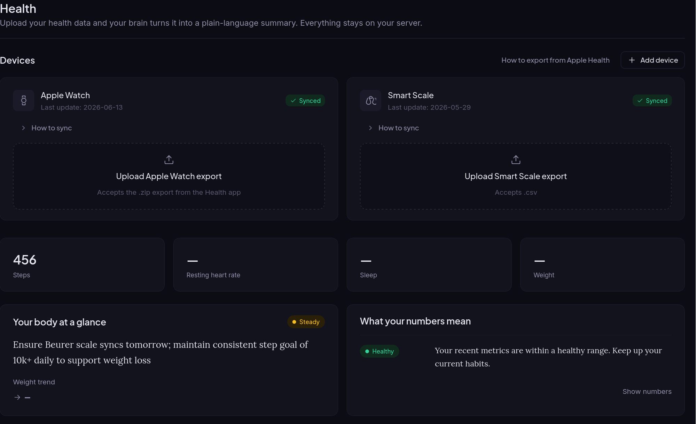
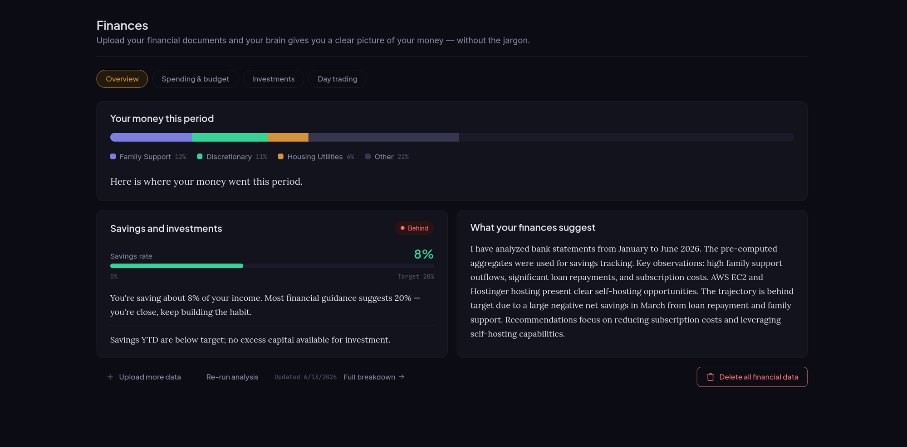
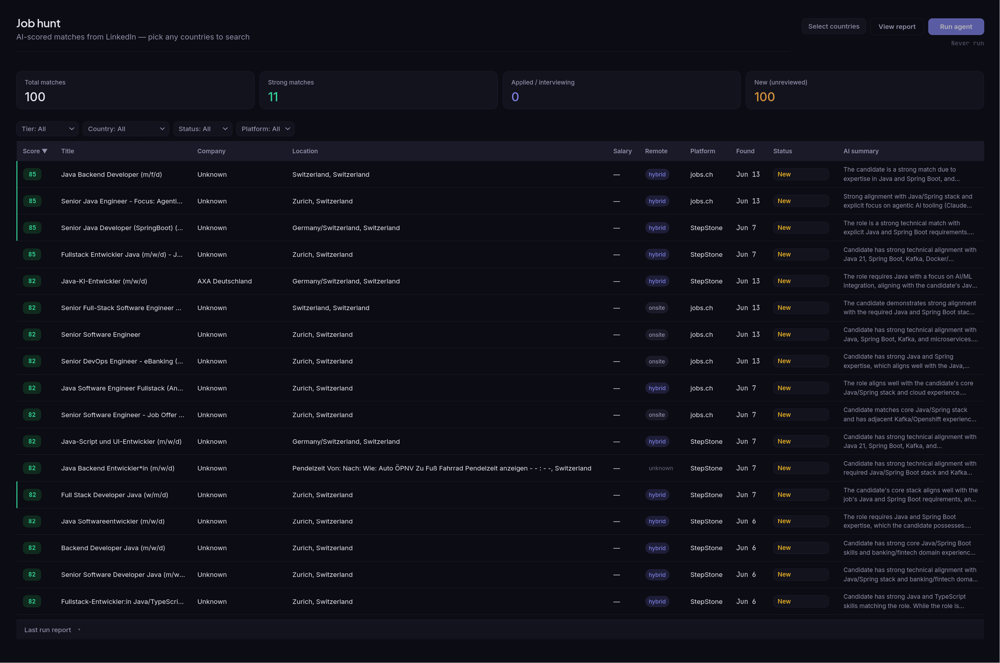

# Private Internet

**A self-hosted, privacy-first AI platform.** Run it on your own server, point it at
your own AI provider keys, and every user gets an isolated AI "brain" (a private vector
memory) that powers a personal content feed, music, video, health insights, finance
analysis, and a job hunter. Your data never leaves your infrastructure.

> One repo, two services, one `.env`. Bring your own API keys — Bedrock, fal.ai,
> Replicate, ElevenLabs, Suno, Gemini — and self-host the whole thing.

---

## What you get

| | |
|---|---|
| **Your Brain** — a private, per-user vector memory. Everything you write or upload makes the platform smarter. |  |
| **PULSE** — an AI social feed of posts (text + image) generated from your memory. |  |
| **SIGNAL** — an AI video channel: scripts, slides/clips, narration, assembled with FFmpeg. |  |
| **ARIA** — AI personal-music: full-length tracks, mood playlists, a persistent mini-player. |  |
| **Health** — upload Apple Watch / smart-scale exports, get a plain-language summary. |  |
| **Finances** — upload statements, get a clear, jargon-free picture of your money. |  |
| **Job hunt** — AI-scored job matches from multiple boards, filterable and reviewable. |  |

---

## Architecture

Two independent services share one repository and one `.env`:

```
                         nginx (HTTPS)
                              │
        /.well-known/  /oauth/*  /api/*  /mcp/*
                              │
            Service A ── private-internet-api  (port 8000, public)
            FastAPI + FastMCP in one process
            · auth (OAuth 2.1/PKCE + email/password JWT)
            · memory (pgvector brain)  · content (PULSE/SIGNAL/ARIA/STORIES)
                              │  http://localhost:8001
                              ▼
            Service B ── private-internet-agents  (port 8001, internal only)
            · email · banking · health · job · trading agents
```

- **Service A** — source `src/private_internet/`. Public API + the MCP server mounted at
  `/mcp` (so Claude Desktop / claude.ai connect unchanged).
- **Service B** — source `agents/`. Background agents, never exposed through nginx.

> The deployed systemd units, EC2 directory, and nginx conf keep the legacy
> `personal-intelligence` name on purpose — renaming them breaks the existing deploy
> pipeline. The product, package, and this repo are **Private Internet**.

---

## Prerequisites

- **Python 3.11+**
- **Node 18+** (for the Vue frontend)
- **PostgreSQL 15+ with the `pgvector` extension** (local Postgres or AWS RDS)
- **FFmpeg** — required by the SIGNAL/STORIES video pipeline (`sudo apt install ffmpeg`)
- **At least one AI provider key** (see [Bring your own AI keys](#bring-your-own-ai-keys))

---

## Quick start (self-host)

### 1. Clone

```bash
git clone git@github.com:adel-haidar/private-internet.git
cd private-internet
```

### 2. Database

Create a Postgres database and enable pgvector. Schema/migrations are applied
**automatically** by Service A on startup — you only create the empty database:

```bash
createdb private_internet
psql private_internet -c 'CREATE EXTENSION IF NOT EXISTS vector;'
```

(Or point `DB_*` at an AWS RDS PostgreSQL instance with pgvector enabled.)

### 3. Configure `.env`

```bash
cp .env.example .env
```

Fill in, at minimum:

```ini
# Database
DB_HOST=localhost
DB_NAME=private_internet
DB_USER=postgres
DB_PASSWORD=...

# Auth / security  (generate: python -c "import secrets; print(secrets.token_hex(32))")
SECRET_KEY=...
DASHBOARD_PASSWORD=...          # gate shown before OAuth; required in production

# Your instance
APP_NAME=Private Internet
APP_DOMAIN=your-domain.com      # no scheme
SEED_ADMIN_EMAIL=you@your-domain.com   # first admin; owns pre-existing data
REGISTRATION_OPEN=true          # false → invite-only (manage.py create-user)
MAX_USERS=100                   # 0 = unlimited
```

Then add the AI provider keys for the features you want — see the table below. Every
AI feature **degrades gracefully** if its key is missing (images fall back to gradients,
video to slides, narration to Polly, music is skipped), so you can start with just one
provider and add the rest later.

### 4. Run the backend

```bash
# Service A — public API + MCP  (port 8000)
python -m venv .venv && source .venv/bin/activate
pip install -e .
uvicorn private_internet.api:app --host 127.0.0.1 --port 8000 --reload
```

```bash
# Service B — agents  (port 8001, separate terminal)
cd agents
python -m venv .venv && source .venv/bin/activate
pip install -r requirements.txt
uvicorn main:app --host 127.0.0.1 --port 8001 --reload
```

### 5. Run the frontend

```bash
cd frontend
npm install
npm run dev
```

Open the dev URL it prints. Log in with `SEED_ADMIN_EMAIL`; the brain starts empty and
fills as you use it.

### 6. Create users (invite-only mode)

```bash
python manage.py create-user you@example.com
```

---

## Bring your own AI keys

Private Internet is provider-agnostic and **self-hostable on your own keys**. Set only
the ones you need; anything left blank disables (or gracefully degrades) that feature.

| Capability | Provider (env var) | Where to get a key |
|---|---|---|
| **Brain embeddings** (the vector memory) | AWS Bedrock Titan v2 *(default)* — AWS creds + `AWS_REGION`. Or fully local **Ollama** `bge-m3`: set `EMBEDDING_BACKEND=ollama`, `EMBEDDING_URL`, `EMBEDDING_MODEL`. | [AWS Bedrock](https://console.aws.amazon.com/bedrock/) · [Ollama](https://ollama.com) |
| **LLM reasoning** (memory, finance, health, jobs, content text) | AWS Bedrock (`BEDROCK_MODEL_ID`, e.g. Nova / Claude Haiku) | [AWS Bedrock](https://console.aws.amazon.com/bedrock/) |
| **Images** (PULSE / SIGNAL) | fal.ai FLUX (`FAL_API_KEY`) — falls back to gradients | [fal.ai](https://fal.ai/dashboard/keys) |
| **Video** (SIGNAL / PULSE / STORIES) | Replicate Wan2.1 (`REPLICATE_API_KEY`) and fal.ai Kling (`FAL_API_KEY`) — falls back to slides | [Replicate](https://replicate.com/account/api-tokens) · [fal.ai](https://fal.ai/dashboard/keys) |
| **Narration / TTS** (SIGNAL) | ElevenLabs (`ELEVENLABS_API_KEY`) — falls back to Amazon Polly | [ElevenLabs](https://elevenlabs.io/app/settings/api-keys) |
| **Music** (ARIA) | Suno (`SUNO_API_KEY`) | [sunoapi.org](https://sunoapi.org) |
| **Research grounding** (content topics) | Google Gemini (`GEMINI_API_KEY`) | [Google AI Studio](https://aistudio.google.com/apikey) |
| **Job search** | RapidAPI JSearch (`RAPIDAPI_KEY`, `RAPIDAPI_HOST`) | [RapidAPI JSearch](https://rapidapi.com/letscrape-6bRBa3QguO5/api/jsearch) |
| **Email agent** *(optional)* | Microsoft Graph (`MS_CLIENT_ID`, `MS_CLIENT_SECRET`) | [Azure App registrations](https://portal.azure.com) |
| **Transactional email** *(optional)* | AWS SES (`EMAIL_BACKEND=ses`, `SES_SENDER_EMAIL`) | [AWS SES](https://console.aws.amazon.com/ses/) |
| **Billing** *(optional)* | Stripe (`BILLING_ENABLED=true`, `STRIPE_*`) | [Stripe](https://dashboard.stripe.com/apikeys) |

**AWS credentials.** Bedrock, Polly, and SES use the standard AWS credential chain —
set `AWS_ACCESS_KEY_ID` / `AWS_SECRET_ACCESS_KEY` in the environment, use an EC2 instance
role, or a configured `~/.aws/` profile. Only `AWS_REGION` lives in `.env`.

> ℹ️ The exact provider **precedence/fallback order** for content image & video
> generation is actively being refined — treat the table above as the set of supported
> providers, not a fixed routing order.

---

## Deployment

Production runs on AWS EC2 behind nginx + CloudFront, with RDS PostgreSQL. Pushing to
`main` auto-deploys via GitHub Actions (backend over SSM, frontend to S3/CloudFront).

See **[DEPLOY.md](DEPLOY.md)** for the full runbook. Quick reference:

```bash
# systemd units (names intentionally keep the legacy personal-intelligence- prefix)
sudo cp systemd/*.service systemd/*.timer /etc/systemd/system/
sudo systemctl daemon-reload
sudo systemctl enable --now personal-intelligence-api personal-intelligence-agents

# nginx
sudo cp nginx/personal-intelligence.conf /etc/nginx/conf.d/
sudo nginx -t && sudo systemctl reload nginx
```

---

## Project layout

```
private-internet/
├── src/private_internet/   # Service A: FastAPI + FastMCP
│   ├── api.py              # app factory + lifespan (runs migrations, mounts /mcp)
│   ├── config.py           # Pydantic Settings (reads .env)
│   ├── database.py         # psycopg2 connection factory
│   ├── auth/               # OAuth 2.1/PKCE + email/password JWT
│   ├── users/              # accounts + JWT tokens
│   ├── memory/             # MCP server + pgvector brain
│   ├── content/            # PULSE / SIGNAL / ARIA / STORIES
│   └── core/               # multi-tenancy, request context, jobs
├── agents/                 # Service B: email, banking, health, job, trading
├── frontend/               # Vue 3 + TypeScript + Vite dashboard
├── mobile/                 # Flutter app
├── migrations/             # SQL migrations (also mirrored at startup)
├── systemd/  nginx/        # deploy units & web server config
└── .github/workflows/      # CI/CD
```

---

## License & credits

Built by [Adel Haidar](https://github.com/adel-haidar). Private Internet is the rebrand of
the original single-user "personal-intelligence" system into a multi-user, self-hostable
product.
